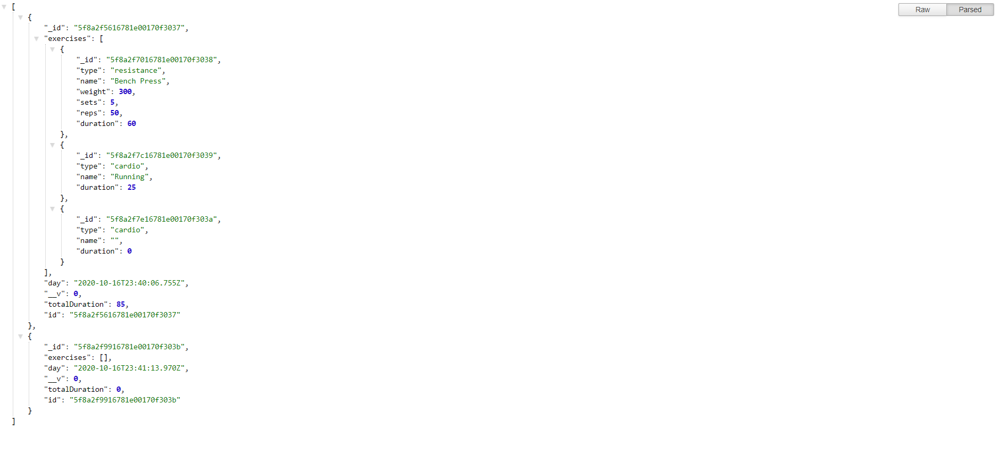

# DanielYu-HomeWork-17-Fitness-Tracker

[](https://opensource.org/licenses/MIT)


### Project Description
* A simple workout full-stack application that user can plan their own workout plan
* The user can really see their workout efficient visually by displaying the total workout duration and different workout in the stats
* The applicaion is deploy on the Heroku and use MongoDB as database

### Usage
1. Click the "new workout" button to beginning the new workout turn


2. Click the "Dashboard" button on the left top to see the workout history display in the stats dashboard


3. Search https://homework-17-fitness-chart.herokuapp.com/api/workouts to check the workout history in JSON version




### Language

```md
HTML
CSS
Javascrpit
Node.js
mongoDB
```

## About
* Heroku link: https://homework-17-fitness-chart.herokuapp.com/
* Project Github: https://github.com/DanielYu0864/DanielYu-HomeWork-17-Fitness-Tracker
* Author: [`DanielYu0864`](https://github.com/DanielYu0864)

## Questions
*  For more question please contact me: adam741963@gmail.com


- - -
© 2020 - UW Coding Bootcamp Homework 17 Fitness Tracker by Daniel Yu